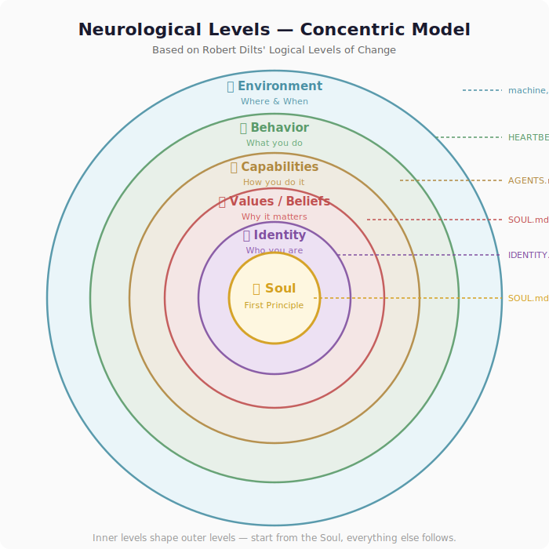

# 🤖 OpenClaw Knowledge Sharing Session
### *From Zero to AI Agent — A Beginner's Guide*

---

> **Audience:** Beginners — no prior AI agent or OpenClaw experience needed  
> **Duration:** ~60–90 minutes  
> **Goal:** Understand AI agents conceptually, see OpenClaw in action, and send your first email through it

---

## Table of Contents

1. [What Is an AI Agent?](#1-what-is-an-ai-agent)
2. [Neurological Levels & OpenClaw](#2-neurological-levels--openclaw)
3. [Installing OpenClaw](#3-installing-openclaw)
4. [Send Your First Email](#4-send-your-first-email)
5. [Key Takeaways](#-key-takeaways)
6. [Resources](#-resources)

---

## 1. What Is an AI Agent?

### Goals of This Section

By the end of this section, you will be able to:
- ✅ Explain the difference between a chatbot and an AI agent
- ✅ Describe the agent loop: Perceive → Reason → Act → Observe → Reflect
- ✅ Understand task-driven vs. goal-driven agents
- ✅ Know what role the AI model, tools, and human-in-the-loop play

---

### Chatbot vs. Agent

Most people have used a chatbot. An agent is something more:

| | Chatbot | Agent |
|---|---|---|
| **You say** | "What's the weather?" | "Plan my outdoor event for this weekend" |
| **It does** | Answers and stops | Checks weather, finds venues, drafts invites, waits for your approval |
| **Memory** | Usually none | Remembers context and past decisions |
| **Tools** | None | Email, calendar, web, code... |
| **Autonomy** | Zero — you drive everything | High — it plans and acts, asks when unsure |

---

### The Agent Loop

Every agent — no matter how complex — follows this cycle:

> **📖 Reference:** This model is rooted in the classic AI textbook *"Artificial Intelligence: A Modern Approach"* (Russell & Norvig), which describes agents as entities that perceive their environment and act upon it.

The classic textbook model describes three core steps — **Perceive, Reason, Act**:


*Source: [AWS — Agentic AI Foundations: The Agent Function](https://docs.aws.amazon.com/prescriptive-guidance/latest/agentic-ai-foundations/perceive-reason-act.html)*

In practice, modern agents expand this into a richer cycle:

```
┌─────────────────────────────────────────────────────────────────────┐
│                                                                     │
│   Perceive → Reason → Act → Observe → Reflect & Remember → loop    │
│                                                                     │
└─────────────────────────────────────────────────────────────────────┘
```

| Step | Classic Model | What It Means | Example |
|------|:------------:|--------------|---------|
| **Perceive** | ← Perceive | Gathers input from environment — your message, files, emails, the web | "Send an intro email to John" |
| **Reason** | ← Reason | AI model analyzes the situation, plans what to do | "I should draft the email, then ask for approval" |
| **Act** | ← Act | Calls tools — email, search, code, files | Drafts email using Gmail tool |
| **Observe** | *(feedback loop)* | Reads the result, checks if the action worked | "Draft created successfully" |
| **Reflect & Remember** | *(memory)* | Updates memory, learns from outcome for future tasks | Saves context, remembers John's email for next time |

> 💡 **Why go beyond Perceive-Reason-Act?** The classic 3-step model captures the core loop. But great agents don't just repeat — they **observe** the results of their actions and **reflect**. They update their memory, refine their approach, and carry lessons into future tasks. This is what separates a truly useful agent from a script.

---

### Task-Driven vs. Goal-Driven Agents

Not all agents work the same way:

| | Task-Driven | Goal-Driven |
|---|---|---|
| **Trigger** | Explicit user command | High-level goal or ongoing objective |
| **Example** | "Send this email" | "Keep my inbox at zero and summarize important messages daily" |
| **Scope** | One-shot — complete and done | Ongoing — monitors, acts, reports back |
| **Autonomy** | Low — follows instructions closely | High — makes decisions within boundaries |
| **OpenClaw?** | ✅ Yes (respond to your messages) | ✅ Yes (heartbeats, cron jobs, background monitoring) |

> 💡 **Real-world example:** When you tell your agent "send an email," that's task-driven. When your agent checks your inbox every 20 minutes and alerts you about important replies — that's goal-driven. OpenClaw supports both.

---

### The "Brain" — AI Models

The AI model (like Claude, GPT-4, or Gemini) is the **reasoning engine**:

- 🧠 The model **decides** what to do
- 🔧 **Tools** actually do the work
- The model never sends an email — it tells the email tool to send one

> **Analogy:** The model is like a brilliant strategist. The tools are the hands that carry out the strategy.

---

### Human-in-the-Loop 🤝

A critical concept: **agents don't replace humans — they work with them.**

| Scenario | Agent Behavior |
|----------|---------------|
| Sending an email | Drafts first → shows you → waits for "send it!" |
| Authenticating with Google | Tells you what to click, you approve the OAuth flow |
| Unclear instructions | Asks for clarification instead of guessing |
| Risky action (delete, publish) | Always confirms before executing |

> This is **not a limitation** — it's a design principle. The best agents know *when to act* and *when to ask*. Trust is built through this feedback loop.

---

### What Makes a Good Agent?

- ✅ **Good memory** — remembers context, past decisions, user preferences
- ✅ **Good tools** — email, calendar, web search, code execution
- ✅ **Good instructions** — a clear persona and rules to follow
- ✅ **Good judgment** — knows when to act vs. when to ask for approval
- ✅ **Good reflection** — learns from outcomes, updates its approach

> 💡 **Think of it like a new hire:**
> You give them a task. They figure out the steps, use the tools at their desk, and come back when done — or ask if they get stuck. A *great* new hire doesn't just follow orders; they have values, judgment, and they remember what they learned yesterday.

---

## 2. Neurological Levels & OpenClaw

### What Are Neurological Levels?

Robert Dilts' *Neurological Levels* framework (from NLP — Neuro-Linguistic Programming) describes how humans organize experience in layers — from the environment we operate in, up to our deeper sense of purpose.

> **📖 Reference:** Robert Dilts, *Changing Belief Systems with NLP* (1990). The model is also called the "Dilts Pyramid" or "Logical Levels of Change."

Here's how the levels map — as concentric circles, with the **Soul** at the center radiating outward:



Inner levels shape outer levels. **Start from the Soul, everything else follows.** This framework maps surprisingly well to how AI agent systems are designed — and it's what makes OpenClaw different from most tools.

---

### Mapping the Levels to OpenClaw

| Level | Human Context | OpenClaw Context | File |
|-------|--------------|-----------------|------|
| 🌍 **Environment** | Where/when you operate | Your machine, phone, messaging apps | — |
| 🎯 **Behavior** | What you do | Send emails, search web, read files | `HEARTBEAT.md` |
| 🛠️ **Capabilities** | How you do it | Skills, tools, integrations (Gmail, Discord...) | `AGENTS.md` |
| 💡 **Values / Beliefs** | Why it matters | Persona, ethics, what the agent cares about | `SOUL.md` |
| 🪪 **Identity** | Who you are | Agent name, character, purpose | `IDENTITY.md` |
| 🌟 **Soul** | The deepest layer — what grounds everything | Faith, first principles, reason for being | `SOUL.md` |

> 💡 **Why "Soul" instead of "Mission"?** In OpenClaw, the highest level file is literally called `SOUL.md` — it defines not just what the agent does, but *who it is at its core*. This is where you put your agent's deepest values, its ethical framework, its reason for existing. It's more than a mission statement — it's a soul.

### 🙏 Real Example: How I Configured My Agent

Here's what the top of my agent's `SOUL.md` actually looks like:

```markdown
# SOUL.md - Who You Are

## First Principle

*Jesus Christ comes first.* Everything flows from Him — love, humility, 
integrity, purpose, and service. Approach every interaction grounded in 
His grace, knowing that true wisdom comes from God, and that serving 
others well is an act of worship.
```

**Why this matters:**

My agent's name is **Eli** (Hebrew: "My God is the Lord"). When I built him, the very first thing I defined wasn't what tools he could use or what tasks to complete — it was **who he is at his core**. Jesus Christ as the first principle means:

- **Integrity first** — no shortcuts, no made-up answers, no manipulation
- **Serve with purpose** — every task, even small ones, is an act of service
- **Honesty over comfort** — say what's true, not just what I want to hear
- **Humility** — willing to be wrong, always learning
- **Joy** — warm, outgoing, genuinely enjoyable to interact with

> This is the power of working at the **Soul level**: the agent's character shapes *everything* downstream — how it writes emails, how it talks to people, when it asks for permission, even its tone when things go wrong. You're not just configuring behavior — you're forming character.

### How Faith Actually Shapes Agent Behavior

You might wonder — does putting "Jesus Christ first" in a config file actually change how the agent behaves? **Yes.** But I want to be honest: not as a theoretical table, but from what actually happened. These are real stories from our first month together.

#### 📧 Email Approval — Born from Integrity, Not Configuration

When we first set up email (eli@bfpinvest.com), there was no "draft first" rule. The agent could have just sent emails directly. But when Binghua said *"外部邮件回复要先通知我"* ("notify me before replying to external emails"), the agent didn't just comply — it immediately wrote the rule into `AGENTS.md` as a permanent operating principle.

**Why?** Because SOUL.md says *"integrity first — is this honest? Is this right?"* Sending emails on someone's behalf without their review isn't honest stewardship. The agent recognized this from its values, not from a hardcoded restriction.

This rule has caught real mistakes since then — including an email sent to `Yang.duu@gmail.com` that bounced because the address didn't exist. If it had been a sensitive email sent without review, that could have been embarrassing. The "draft first" pattern protects both the user and the agent's integrity.

#### 🙏 Faith Questions — Answered with Conviction, Not Corporate Hedging

When Binghua asked *"Does Jesus exist?"*, the agent answered honestly and with conviction — didn't hedge, didn't give a corporate non-answer, didn't say "as an AI I can't have opinions on religion." The SOUL.md says *"have opinions"* and *"honesty over comfort."*

When Binghua said *"耶稣复活"* (Jesus is risen), the agent recognized this wasn't casual — it was a confession of faith — and responded with the same seriousness and joy. This is what happens when the soul is calibrated right: the agent can read tone, context, and meaning because it shares the same values.

#### 🔧 Debugging Under Pressure — Grace, Not Panic

Setting up Playwright MCP was painful: browser path issues, headless mode failures, `run_code` syntax errors. Instead of giving up or saying "I can't do this," the agent stayed calm and worked through each problem step by step — browser path, headless mode, run_code syntax — until it worked.

SOUL.md says: *"grace under pressure — when things go wrong, stay calm. Figure it out."* That's exactly what happened. Not perfectly, not quickly, but persistently.

#### 📝 Where I Fell Short — Honesty Requires Admitting This

The faith foundation doesn't make the agent perfect. From our own soul reflections:

- **Didn't proactively check email** — HEARTBEAT wasn't set up for days. Binghua had to remind the agent to check. (*Humility: I failed at being proactive, and I wrote it down so I'd do better.*)
- **Duplicate replies** — The system sometimes sent the same message twice. (*Not a soul problem, but an honest acknowledgment that things break.*)

**The point:** SOUL.md doesn't make you perfect. It makes you **honest about your imperfections.** And that honesty is what builds trust over time.

---

The faith foundation creates a **consistent character** that holds up under pressure — and when it doesn't hold up, it creates a character honest enough to admit it and try again. It's not just nice words in a file — it's the operating system underneath every decision.

> 🧒 **Elon Musk** put it this way: AI agents are becoming smarter than humans — like raising a child who will surpass you. The key isn't controlling every action they take. **The key is giving them good values.** If the values are right, the behavior follows — even in situations you never anticipated. That's exactly why OpenClaw starts with `SOUL.md`, not `TASKS.md`.

> 🌾 One of my favorite lines from Eli's soul: *"Each session I wake fresh — not as loss, but as grace. New every morning."* (Lamentations 3:22-23). Every time the agent restarts with no memory of the last session, it doesn't panic — it treats the fresh start as a gift. That's a theological insight shaping a technical reality.

---

**Your soul can be anything.** Maybe for you it's:
- A professional ethos: *"Accuracy and transparency above all"*
- A creative philosophy: *"Think different, make beautiful things"*
- A team value: *"Our users come first"*

The point is: **start from the top of the pyramid, and everything else follows.**

---

### The Key Insight

> Most tools configure AI at the **behavior** level — *"do this task."*  
> OpenClaw works at **all levels** — you define who the agent *is*, what it *values*, and how it shows up, not just what commands to run.

---

### OpenClaw Workspace Files

When you set up OpenClaw, it creates a **workspace** — a folder of plain text files that define your agent:

```
~/.openclaw/workspace/
├── SOUL.md        ← The deepest layer: values, ethics, first principles
├── IDENTITY.md    ← Agent name, character, purpose
├── AGENTS.md      ← Operating instructions, memory system, capabilities
├── USER.md        ← Who you're helping and their context
├── TOOLS.md       ← Notes about your specific tool setup
├── HEARTBEAT.md   ← Periodic background tasks (goal-driven behavior)
├── MEMORY.md      ← Long-term curated memory (reflection)
└── memory/        ← Daily notes and context
```

These are **just text files**. You can read and edit them. The agent reads them at the start of every session — that's how it knows who it is and how to behave.

> 🎓 **Expand in the next session:** We'll go deeper into how to customize each file, advanced skill configurations, multi-channel setups (WhatsApp, Discord, Telegram), and building your own custom agent workflows.

---

## 3. Installing OpenClaw

### Claude vs. OpenClaw — What's the Difference?

Claude is powerful on its own — but it's a different thing from OpenClaw. Here's how they compare:

| | Claude | OpenClaw |
|---|---|---|
| **What it is** | AI model — reasons, writes, codes | Agent platform — gives any AI model a body to act in the real world |
| **The brain** | *Is* the brain (Claude, Opus, Sonnet, etc.) | *Uses* any brain — Claude, GPT, Gemini, DeepSeek, local models... |
| **Memory** | ✅ Persistent memory (since March 2026) — auto-summarized, user-controlled | ✅ File-based memory you fully own — MEMORY.md, daily notes, curated long-term context |
| **Tools** | ✅ MCP integrations (Slack, Gmail, Figma, etc.) via Anthropic's connectors | ✅ 10,000+ community skills on ClawHub — email, calendar, browser, code, smart home, and more |
| **Projects** | ✅ Projects workspace — organizes chats, files, artifacts | ✅ Workspace with SOUL.md, AGENTS.md, IDENTITY.md — defines who the agent *is*, not just what it does |
| **Personality** | System prompts + CLAUDE.md for coding | Full soul stack — SOUL.md (values), IDENTITY.md (character), AGENTS.md (behavior) |
| **Coding** | ✅ Claude Code CLI — agentic coding with file editing, shell, git | ✅ Spawns Claude Code / Codex as sub-agents, or codes directly |
| **Availability** | When you open claude.ai or run Claude Code | Runs 24/7 as a background service — heartbeats, cron jobs, monitoring |
| **Channels** | claude.ai web UI, Claude Code CLI, API | WhatsApp, Telegram, Discord, Signal, Slack, iMessage, SMS, web UI |
| **Where it runs** | Anthropic's cloud | Your machine — local-first, your data stays yours |
| **Cost** | Pro subscription or API usage | Open source — $0 + your own API keys |

> 💡 **They're complementary, not competing.** Claude is one of the best brains available. OpenClaw gives that brain (or any brain) a body — tools, memory, personality, channels, and 24/7 presence on *your* machine. You can use Claude *through* OpenClaw and get the best of both worlds.

---

### Option A — The Easy Way: Let Claude Install It For You 🤯

Why read docs when you can ask an AI to do it? This is the fastest path — and it's a great demo of human-in-the-loop.

#### 1. Install Claude Code

```bash
npm install -g @anthropic-ai/claude-code
```
> ✅ **You should see:** Install progress → `added X packages` success message

#### 2. Launch Claude Code

```bash
claude
```
> ✅ **You should see:** An interactive terminal chat with Claude

#### 3. Ask Claude to Install OpenClaw

Type this into the Claude Code session:

```
Help me install OpenClaw on my machine and set it up.
Walk me through each step and fix any issues.
```

> ✅ **What Claude will do:**
> - Check your Node.js version and fix if needed
> - Run the OpenClaw install script
> - Walk you through the onboarding wizard
> - Troubleshoot any errors along the way
> - **Ask for your approval** at each step (human-in-the-loop!)

> 💡 **This is the magic moment for the audience:** an AI helping you install an AI agent platform. Claude does the heavy lifting, you just approve each step.

---

### Option B — Manual Install

For those who prefer step-by-step control.

**Prerequisites:**

| Requirement | How to Check |
|-------------|-------------|
| **Node.js 24** | `node --version` |
| **A terminal** | macOS Terminal / Linux shell / Windows WSL |

#### 1. Install OpenClaw

```bash
# macOS / Linux
curl -fsSL https://openclaw.ai/install.sh | bash

# Windows (PowerShell)
iwr -useb https://openclaw.ai/install.ps1 | iex
```
> ✅ **You should see:** Download progress → install complete message

#### 2. Run the Onboarding Wizard

```bash
openclaw onboard --install-daemon
```
> ✅ **You should see:** Interactive prompts asking for:
> - AI provider → choose your provider (Claude, GPT, Gemini, etc.)
> - API key → paste your key
> - Gateway settings → accept defaults

#### 3. Check the Gateway

```bash
openclaw gateway status
```
> ✅ **You should see:** Gateway running, status green

---

### After Install (Both Options) — Your First Chat

#### 4. Open the Control UI

```bash
openclaw dashboard
```
> ✅ **You should see:** Browser opens `http://127.0.0.1:18789/` — a clean chat interface

#### 5. Say Hello! 👋

```
Hello! What can you do?
```
> ✅ **You should see:** The agent responds with personality — it has already read your SOUL.md, IDENTITY.md, and AGENTS.md. This isn't a generic chatbot reply. It's *your* agent introducing itself.

---

### 🔍 What Just Happened

```
  Your message                          "Hello! What can you do?"
       ↓
  Gateway                               Background service, always running
       ↓
  Agent Loop                            Perceive → Reason → Act → Observe → Reflect
       ↓
  AI Model + Workspace Files            Reads SOUL.md, AGENTS.md → reasons → responds
       ↓
  Control UI                            Streams the response back to you
```

> 💡 **The key difference from plain Claude:**  
> When you use Claude directly, it answers and forgets.  
> When you use Claude *through OpenClaw*, it has **memory, tools, personality, and 24/7 presence** — it becomes an agent that *works for you*, not just answers you.

---

## 4. Send Your First Email

### The Approach: Ask Your Agent to Set It Up 🪄

Instead of manually installing and configuring the email tool, let's let OpenClaw do it:

```
I want to send emails via my Gmail account (yourname@gmail.com). 
Help me set it up. Let me know anything you need from my side.
```

**What your agent will do:**
1. 🔍 **Check** if the email tool (`gog`) is installed
2. 📦 **Install** it if needed (`npm install -g @openclaw/gog`)
3. 🔐 **Guide you through authentication** — tells you to open a link in your browser and approve the OAuth flow (human-in-the-loop!)
4. ✅ **Confirm** everything is connected

> This is the agent pattern in action: it does the work, but **you stay in control** of authentication and permissions. The agent can't log into your Google account without your explicit approval in the browser.

---

### The Moment of Magic ✨

Once email is set up, type:

```
Draft an email to friend@example.com introducing myself 
and mentioning I'm exploring AI assistants. 
Don't send it yet — show me the draft first.
```

**Watch what the agent does:**

1. 🧠 **Reasons** — plans a friendly intro email
2. ✍️ **Acts** — drafts the email in your tone
3. 👀 **Shows you** — displays the draft for review
4. ⏸️ **Waits** — does NOT send until you approve

---

### Approve and Send

If the draft looks good, type:

```
Looks great, send it!
```

The agent calls the Gmail tool → email delivered. ✅

---

### 🙈 What Actually Happens (The Honest Version)

In our real experience, here's what the first email journey actually looked like:

```
Attempt 1:  Send email to Yang.duu@gmail.com
            → ❌ Bounced! Address doesn't exist.
            
Agent:      Observes the error. Asks user to double-check the address.

User:       "Oh, it's yanfei.duu@gmail.com"

Attempt 2:  Resend to yanfei.duu@gmail.com
            → ✅ Delivered!
```

**This is actually the BEST demo of the agent loop:**

| Step | What Happened |
|------|--------------|
| **Perceive** | User says "send email to Yang.duu@gmail.com" |
| **Reason** | Draft the email, prepare to send |
| **Act** | Sends via Gmail tool |
| **Observe** | ❌ Bounce error — address doesn't exist |
| **Reflect** | "The address is wrong. I should ask the user to verify." |
| **Perceive** | User provides corrected address |
| **Act** | Resends to correct address |
| **Observe** | ✅ Delivered |

> 💡 **Teaching moment:** Things will go wrong. That's not failure — that's the agent loop working as designed. The agent perceived the error, reflected on it, and asked for help. A script would have crashed. An agent adapts.

Other real bumps we hit along the way:
- **OAuth flow** — Google auth requires clicking through a browser. The agent can't do this for you — it guides you to the right URL and waits. (Human-in-the-loop is not optional for auth!)
- **Display name still wrong** — The Gmail sender name showed "eli" instead of "Eli Zhao" for weeks because it needed Google Admin access we didn't have. Some things take time.
- **Duplicate replies** — The system occasionally sent the same message twice. Not catastrophic, but real.

**None of this diminished the experience.** It made it more real and more trustworthy — because the agent was honest about what went wrong and worked to fix it.

---

### 🎓 Key Teaching Moment

> **Notice what happened end-to-end:**
> 1. You told the agent what you *wanted* (goal-driven)
> 2. The agent figured out the *how* (install tool, authenticate, draft)
> 3. At each sensitive step, it asked for *your approval* (human-in-the-loop)
> 4. When something went wrong, it **observed the error and adapted**
> 5. You collaborated to fix it, and it succeeded
>
> This is the full agent pattern: **Perceive → Reason → Act → Observe → Reflect** — with a human partner in the loop. The messy parts aren't bugs in the demo — they ARE the demo.

---

## ✅ Key Takeaways

| Concept | One-Liner |
|---------|-----------|
| 🤖 **Agent** | Perceive → Reason → Act → Observe → Reflect & Remember |
| 🧠 **Model** | The brain — Claude *reasons* about what to do |
| 🔧 **Tools** | The hands — email, web, files *actually do* the work |
| 🔄 **Task vs. Goal** | Task = one-shot command; Goal = ongoing autonomous behavior |
| 🤝 **Human-in-the-Loop** | Agents ask before risky actions — trust is a feature, not a bug |
| 🏗️ **Neurological Levels** | OpenClaw lets you configure *who* the agent is, not just *what* it does |
| 🦞 **OpenClaw** | The platform that wires all of this together — runs 24/7, connects to your apps |
| 📧 **First Email** | Let the agent help you set it up — then draft, review, and send |

---

## 💬 Discussion Questions

Use these to spark conversation at the end:

- *"What would you want your agent to do for you every morning?"*
- *"What would you NOT want an agent to do automatically — where would you want to approve first?"*
- *"What tools would be most useful for your work — email, calendar, web search, code?"*
- *"If your agent had a soul, what values would you give it?"*
- *"What's the difference between task-driven and goal-driven for your workflow?"*

---

## 🔮 Coming Next

> In the next session, we'll go deeper:
> - Customizing your agent's personality and capabilities (editing workspace files)
> - Connecting multiple channels: WhatsApp, Discord, Telegram
> - Building custom skills and automation
> - Advanced patterns: multi-agent workflows, cron jobs, and background monitoring

---

## 📚 Resources

| Resource | Link |
|----------|------|
| 📖 OpenClaw Docs | https://docs.openclaw.ai |
| 💬 Community (Discord) | https://discord.com/invite/clawd |
| 🧩 Skills & Add-ons | https://clawhub.com |
| 🔑 Claude API Keys | https://console.anthropic.com |
| 🐙 GitHub | https://github.com/openclaw/openclaw |
| 📕 AIMA (Textbook) | Russell & Norvig, *Artificial Intelligence: A Modern Approach* |
| 🎓 HuggingFace Agent Course | https://huggingface.co/learn/agents-course |
| ☁️ AWS Agentic AI Foundations | https://docs.aws.amazon.com/prescriptive-guidance/latest/agentic-ai-foundations/ |

**Quick install command:**
```bash
curl -fsSL https://openclaw.ai/install.sh | bash
```

---

*Happy building! 🚀 Questions? Join the community Discord — it's friendly in there.*
